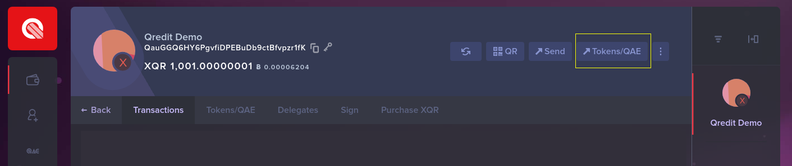
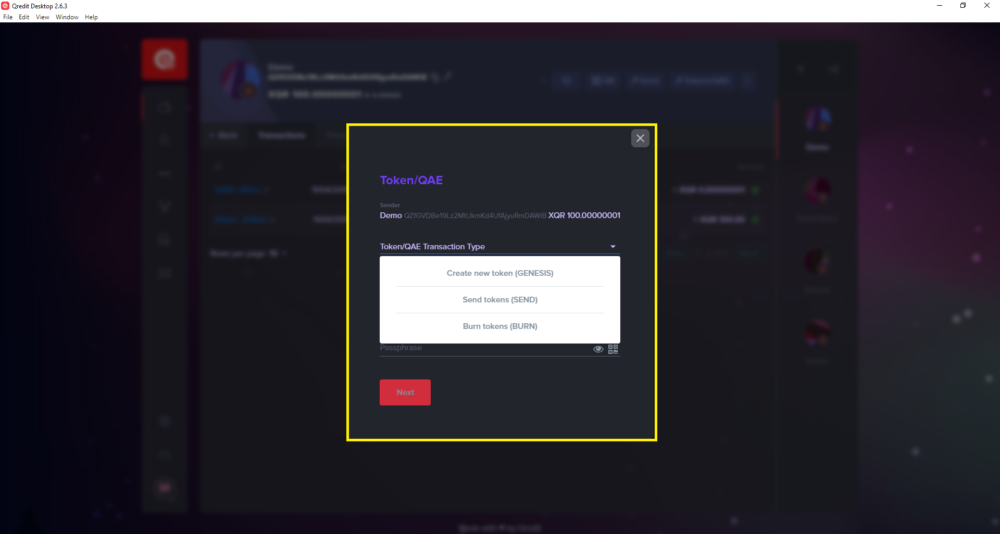
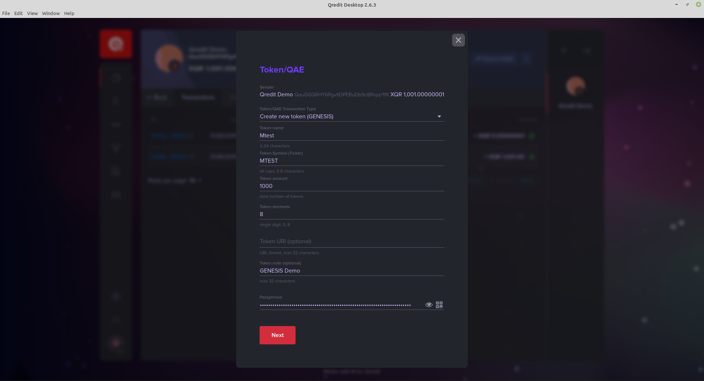
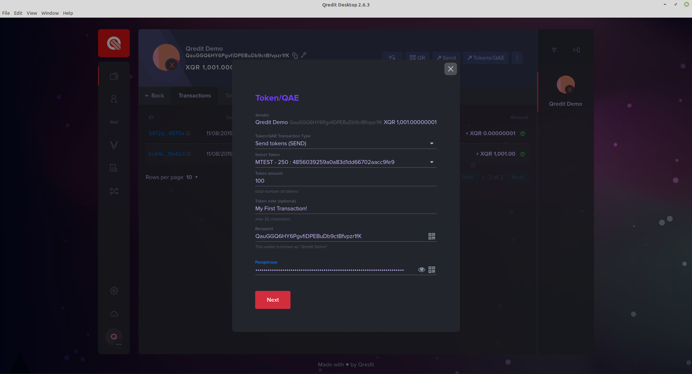
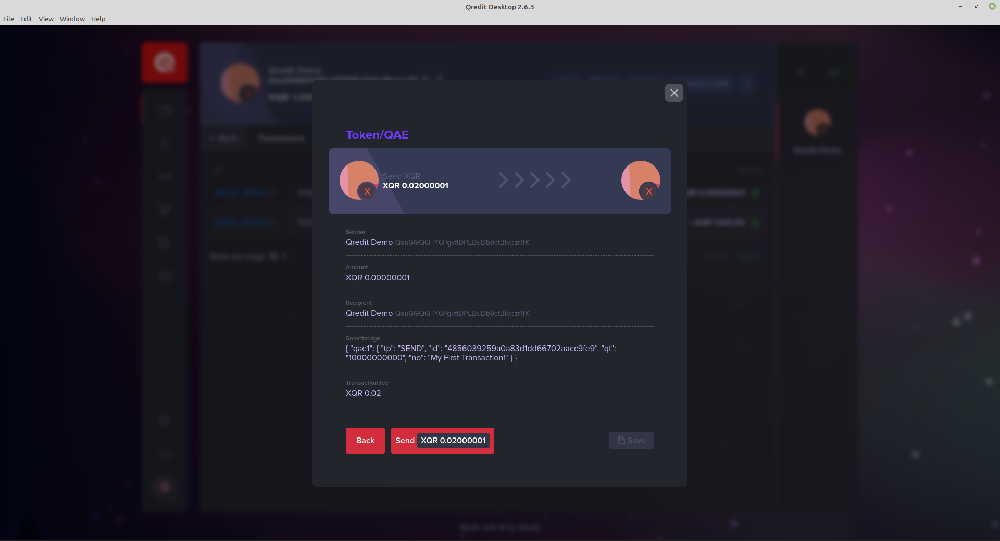

# How to Interact with QAE, using the Qredit Desktop Wallet

This guide will learn you how to interact with QAE tokens using the Desktop Wallet. We will explain and show you the GENESIS, SEND and BURN transaction, all available to use with the Desktop Wallet.

## Creating a QAE token (GENESIS transaction)
If you want to create your own token on the Qredit Network, you first need to do a GENESIS transaction. In this transaction you register your token, and your token specific settings onto the blockchain. 

:::tip
The address you are using to make the transaction with, will be marked as the OWNER of the contract. This is important for the more advanced contract interactions, that are not (yet) supported by the desktop wallet. 

The cost of a Genesis Transaction, is 1.000,02 XQR. Make sure you have this in your wallet, before continueing.
:::

First, go to the QAE Interaction Screen, and select ```create new token (GENESIS)```.





A form will appear, where you can input your Token specific information. 



```json
Token Name                              The Name you want to give your Token 
Token Symbol (Ticker)                   The ticker or abbreviation you  want your Token to have
Token Amount                            The amount of Tokens you want to create. This will be your total supply
Token Decimals                          The amount of decimals in what your tokens can be divided
Token URI (optional)                    ?
Token Note (optional)                   This is a note that you can send with your transaction. Similair to the Qredit Smartbridge
Passphrase (or Encryption Password)     The Private key of the wallet. This is used to sign the transaction
```

When you have filled in and double checked all your information, press ```Next```. You will go to a confirmation screen. Make sure everything is filled in as you wish. After confirming, your transaction will be made, and can not be changed. If all is correct, select ```Send 1000.02 XQR```. Now, your transaction will be send to the Qredit Blockchain. 

Within a few minutes, your transaction will be confirmed. You will now have your freshly minted Tokens into your wallet!


## Sending a QAE token (SEND transaction)






## Burning a QAE token (BURN transaction)