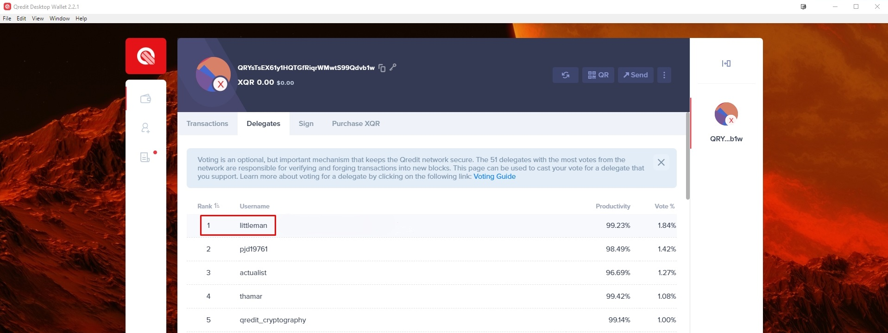
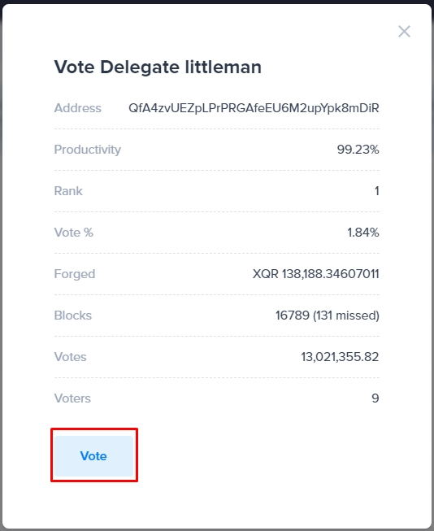
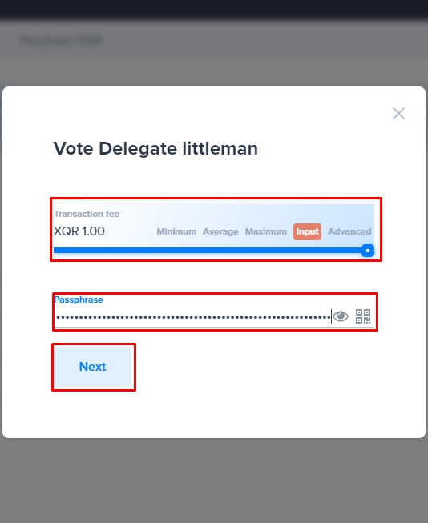
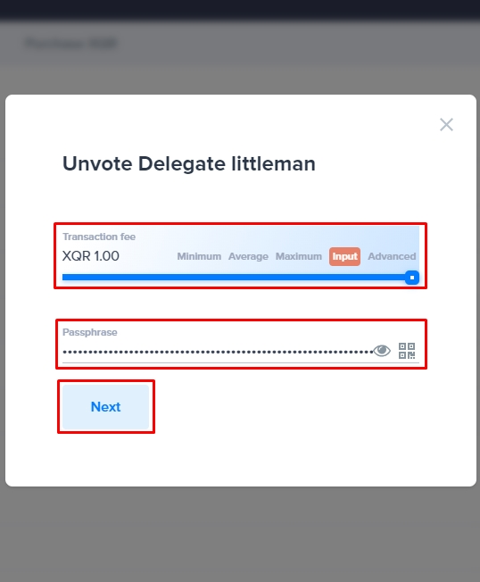
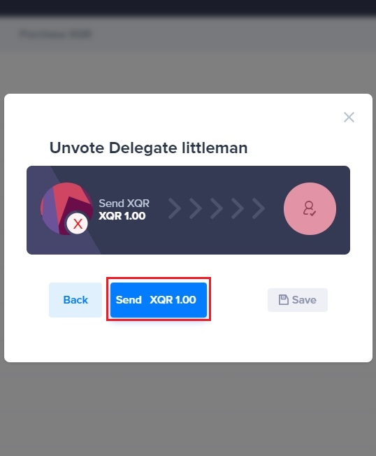

# How To Vote/Un-Vote In the Qredit Desktop Wallet

You can use your XQR to vote or un-vote a delegate. In this guide, we’ll show you how to vote for a delegate, or un-vote a delegate if you want to change your vote.

Some basic voting info :

- One Qredit address can vote for only one delegate at a time. If you wish to vote for more than one delegate you can create multiple wallets, split your XQR among those wallets and vote for a different delegate with each wallet. For example, if you have 1000 XQR, you can vote for one delegate with all of your XQR in one wallet, or you can divide your XQR into two wallets of 500 XQR each and vote for two different delegates. You can create as many wallets as you want and divide your XQR among them in any proportion you choose.
- One XQR equals a voting weight of 1. The more XQR you hold, the more voting weight you possess. If you split your XQR into multiple wallets, your voting power divides proportionally among those wallets. For example, if you have 1,000 XQR your voting power is equal to 1,000 XQR. If you split your XQR into two wallets, each will have a voting power of 500 XQR.
- Each vote or un-vote comes with a fee. Each transaction in the XQR network costs a certain amount of XQR. With the implementation of dynamic fees, this cost has become adjustable. You can choose how much you want to spend for each specific transaction, even for voting and for un-voting.

## Whom to Vote for?

You can see the list of currently active delegates on the delegate monitor. There is also a calculator available. 

## Casting a Vote

Open the Qredit Desktop Wallet and select the wallet you wish to vote with. The wallet can be chosen from the menu on the right.

From within the chosen wallet, click on the **_Delegates_** button to open the delegate view where you can cast your vote (note: there is an indicator that lets you know if you are not yet voting from the selected wallet).

In the delegate selection window, you can scroll up or down to view the full list of active delegates (51 are currently responsible for validation and creation of new blocks). Once you see the delegate, you wish to vote for click on it. If your delegate is not yet active (in the top 51), you can go to the second page to view standby delegates.

Selecting a delegate will display basic statistics about that delegate. To cast your vote click on the **_Vote_** button.

Now, you can select your ‘voting fee' for this specific voting transaction. You can choose from a predefined range of fees or input a custom fee that you wish to pay for voting. Note that if you select a fee that is too low, it will not be accepted by any of the currently active delegates. If no delegate accepts your transaction, it will not be confirmed and will remain in the transaction pool for 45 minutes before being dropped. After selecting your voting fee, input your wallet passphrase and press **_Next_** to continue.

The final step is to review the transaction information and press the **_Send_** button. You also have the option to go **_Back_** to the previous screen or **_Save_** the signed transaction in JSON format (for advanced users).

That’s it! A message in the lower left corner tells you that the transaction was broadcasted successfully.

Now you can see if your transaction was confirmed. Clicking on the refresh button shows that there is a new transaction in your wallet.

To see the number of confirmations for your transaction hover over the clock on the far right. One or more confirmations verify that your voting transaction was successfully included in the block. You are now voting for a delegate - congratulations!

### Un-voting

Open the Qredit Desktop Wallet and select the wallet you wish to un-vote from. Again, the wallet can be chosen from the menu on the right.

From within the chosen wallet, click on the **_Delegates_** button to open the delegate view where you can un-vote.

Once in the delegate selection window, you can click on the **_Unvote_** button at the bottom, or you can scroll up or down the list click the delegate directly to un-vote.

Now, basic statistics will be displayed about the delegate you are un-voting. Click the un-vote button to continue with un-voting.

The un-voting fee selection process is the same as described above for voting. Select from a predefined range of fees or input a custom fee that you wish to pay for un-voting. Then input your wallet passphrase and press **_Next_** to continue.

The last step is to review the transaction information and press the **_Send_** button. You also have the option to go **_Back_** to the previous screen or **_Save_** the signed transaction in JSON format (for advanced users).

You’re done! You should get a message in the lower left corner stating that the un-voting transaction was broadcasted successfully.

Now, to see if your transaction was confirmed, click on the refresh button in the menu to update the window and see a new transaction in your wallet.

The un-voting transaction now shows in your list of transactions. You can hover over the clock to see the number of confirmations for that transaction. One or more confirmations means your un-voting transaction was successfully included in the block.

To cast a vote for newly selected delegate scroll back to the **_Voting_** section of this article and repeat those steps.
